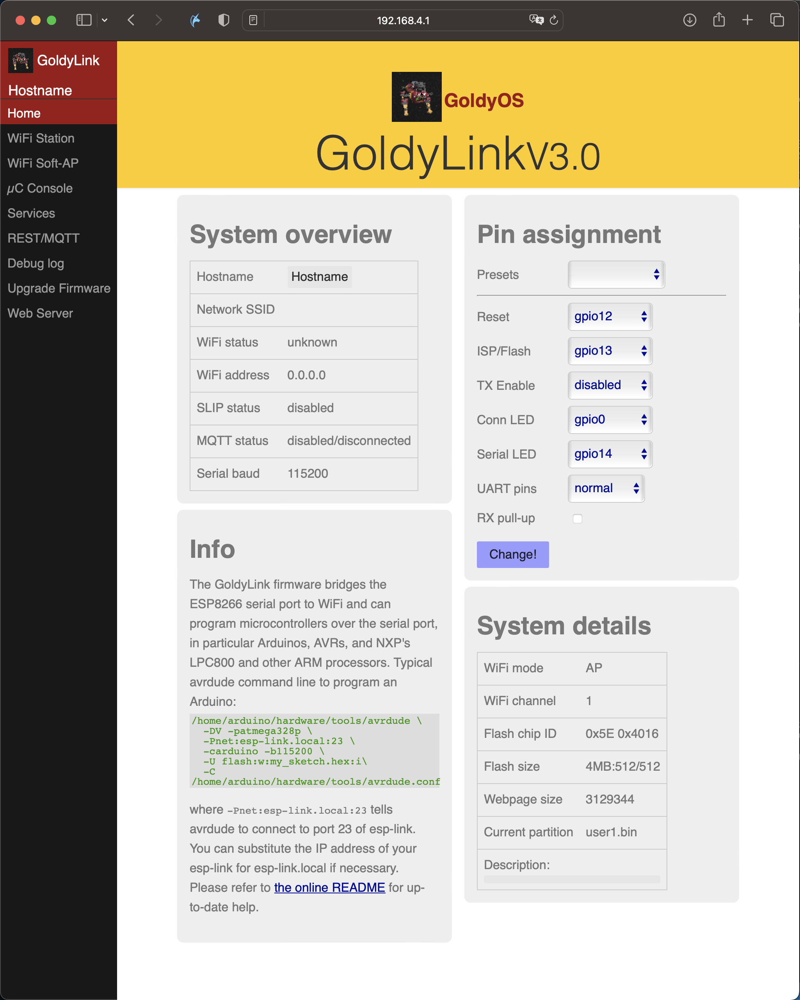
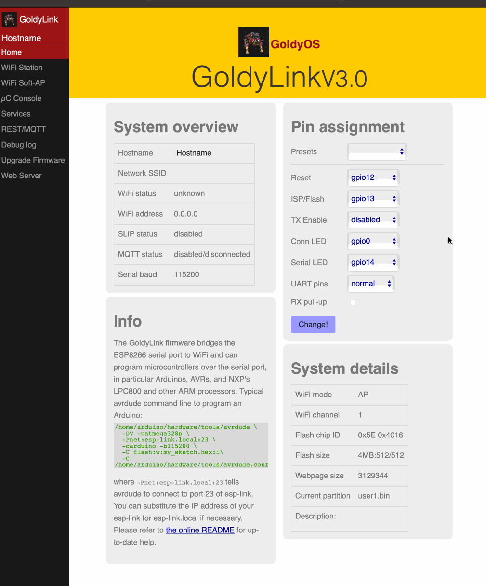
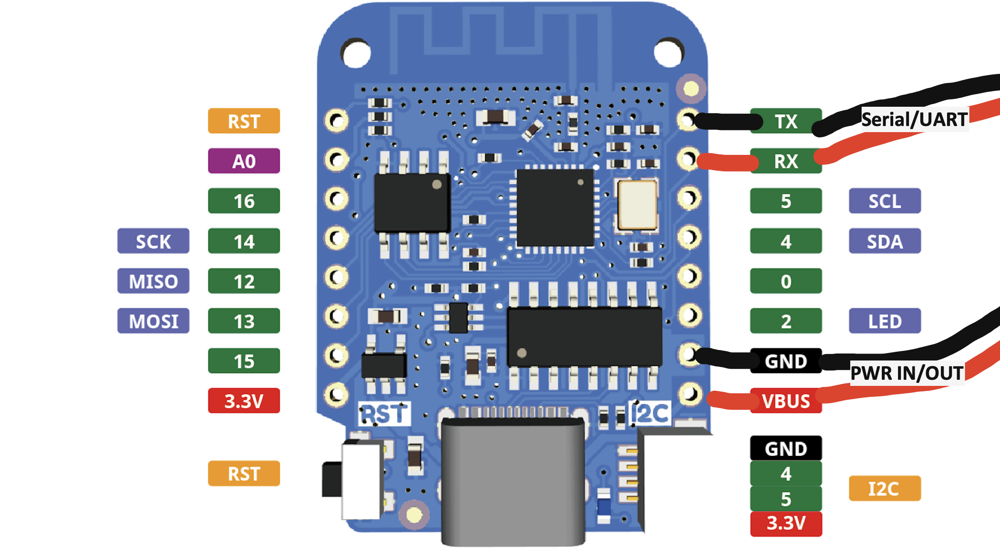
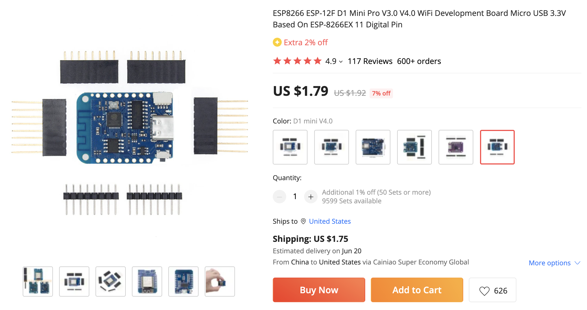
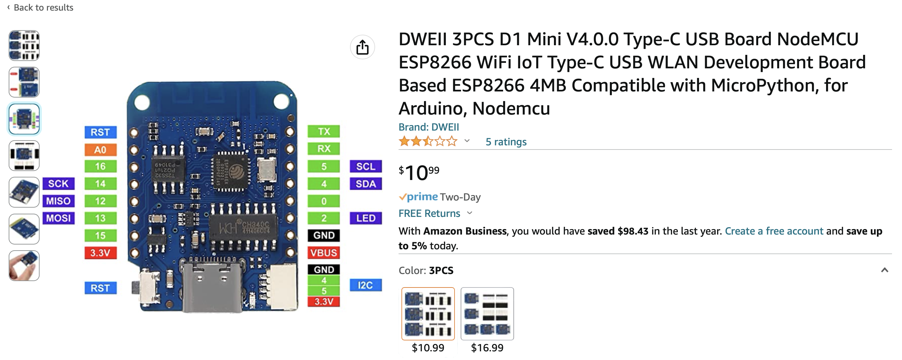
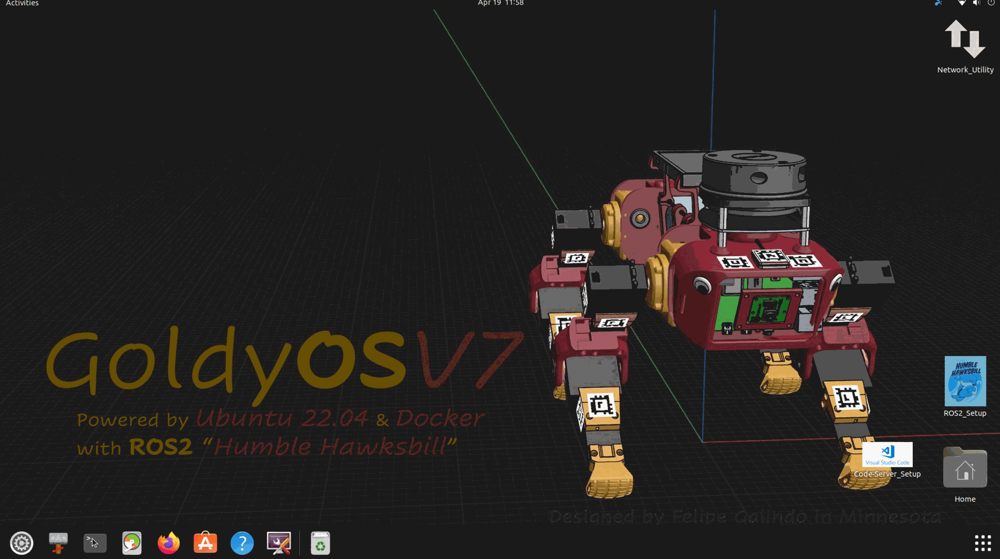

# GoldyLink: Wifi-Serial Bridge w/REST&MQTT

#### This project is a work in progress. 


[WiFi Web UART for Raspberry Pi]()



# Quick Start Guide
Hardware Setup 
---------------
The recomended setup is a D1 Mini V4 ESP8266 Board. You may purchase these boards and solder stuff yourself, or in the future I might sell complete, pre-programmed kits with a wire harness for your microcontroller for $10

[D1 Mini Docs](D1 mini)


[Aliexpress](https://www.aliexpress.us/item/2251832676903780.html?spm=a2g0o.order_detail.order_detail_item.3.779ff19ckNFde5&gatewayAdapt=glo2usa&_randl_shipto=US)



[Amazon (3x) recomended](https://www.amazon.com/DWEII-NodeMCU-Development-Compatible-MicroPython/dp/B0B8CK8YZR/ref=sr_1_3?crid=2BYV1TJ5I4FB4&keywords=D1%2Bmini%2Bv4&qid=1681922036&sprefix=d1%2Bmini%2Bv4%2Caps%2C106&sr=8-3&th=1)


(image of GoldyLink Kit)
(image of GoldyLink Back)

Software Setup 
---------------

To get started you need to:

 1. Install VS code on your computer if you do not already have it. 

 Note You can use whatever OS you like, including MacOS & Windows. [Visual Studio Code for Other OS](https://code.visualstudio.com/docs/setup/setup-overview)

 [Visual Studio Code for Linux](https://code.visualstudio.com/docs/setup/linux)

 

 
```
sudo apt-get install wget gpg
wget -qO- https://packages.microsoft.com/keys/microsoft.asc | gpg --dearmor > packages.microsoft.gpg
sudo install -D -o root -g root -m 644 packages.microsoft.gpg /etc/apt/keyrings/packages.microsoft.gpg
sudo sh -c 'echo "deb [arch=amd64,arm64,armhf signed-by=/etc/apt/keyrings/packages.microsoft.gpg] https://packages.microsoft.com/repos/code stable main" > /etc/apt/sources.list.d/vscode.list'
rm -f packages.microsoft.gpg
```



This one might take a while :

```
sudo apt install apt-transport-https
sudo apt update
sudo apt install code # or code-insiders
```


 2. Install Platformio & Libraries. 
 3. Download Github Repo 
 4. Open Project through Platformio
 5. Verify that project builds

 6. Prepare your ESP8266 module for serial flashing. Make sure that the Serial/UART port, and PWR port are UNPLUGGED from the micro controller while you're flashing the firmware for the ESP8266. Very bad things will happen if you forget to unplug these to you. Also, remember to get a solid USB-C cable that isn't cheap or worn out. You do not want to brick your ESP8266.

 7. flash the firmware
 8. configure the Wifi in GoldyLink for your network & configure your settings. 

You can then attach a uC and upload a sketch:
 1. attach a uC (e.g. arduino) to your esp8266 module
 2. connect via the serial port to see a pre-loaded sketch running
 3. upload a fresh version of the sketch

From there, more advanced steps are:
- write a sketch that uses MQTT to communicate, or that makes outbound REST requests
- create some web pages and write a sketch that populates data in them or reacts to buttons
  and forms
- make changes or enhancements to GoldyLink and build your own firmware

The GoldyLink firmware connects a micro-controller to the internet using an ESP8266 Wifi module.
It implements a number of features:

- transparent bridge between Wifi and serial, useful for debugging or inputting into a uC
- flash-programming attached Arduino/AVR microcontrollers and
  LPC800-series and other ARM microcontrollers via Wifi
- built-in stk500v1 programmer for AVR uC's: program using HTTP upload of hex file
- outbound REST HTTP requests from the attached micro-controller to the internet
- MQTT client pub/sub from the attached micro-controller to the internet
- serve custom web pages containing data that is dynamically pulled from the attached uC and
  that contain buttons and fields that are transmitted to the attached uC (feature not
  fully ready yet)

The firmware includes a tiny HTTP server based on
[esphttpd](http://www.esp8266.com/viewforum.php?f=34)
with a simple web interface, many thanks to Jeroen Domburg for making it available!
The REST and MQTT functionality are loosely based on [espduino](https://github.com/tuanpmt/espduino)
but significantly rewritten and no longer protocol compatible, thanks to tuanpmt for the
inspiration!

The following people contributed significant functionality to GoldyLink:
[brunnels](https://github.com/brunnels) (espduino integration),
[cskarai](https://github.com/cskarai) (custom dynamic web pages),
[beegee-tokyo](https://github.com/beegee-tokyo) (lots of code documentation),
[susisstrolch](https://github.com/susisstrolch) (syslog feature),
[bc547](https://github.com/bc547) and [katast](https://github.com/katast) (misc contributions).
GoldyLink is the work of many contributors!

Note that [http://github.com/jeelabs/esp-link](http://github.com/jeelabs/esp-link) is the original code which has notably been forked by arduino.org and shipped
with the initial Arduino Uno Wifi and now for the GoldyLink software. 

[Why you **shoudn't** use original repo](#why-you-shoudnt-use-original-repo)


**The `master` branch of this fork has been updated to integrate all changes**
**from `fix-master` and `platformio`.**
**This branch now builds with PlatformIO.**

### Quick links

In this document: [goals](#GoldyLink-goals), [uses](#GoldyLink-uses), [eye candy](#eye-candy),
[getting-started](#getting-started), [serial-bridge](#serial-bridge), [contact](#contact).

Separate documents:
- [hardware configuration](FLASHING.md), [serial flashing](FLASHING.md#initial-serial-flashing)
- [wifi configuration](WIFI-CONFIG.md)
- [troubleshooting](TROUBLESHOOTING.md), [LED indicators](TROUBLESHOOTING.md#led-indicators)
- [flashing an attached uC](UC-FLASHING.md)
- [MQTT and outbound REST requests](RESTMQTT.md)
- [service web pages](WEB-SERVER.md)
- [building GoldyLink](BUILDING.md), [over-the-air flashing](BUILDING.md#updating-the-firmware-over-the-air)
- [flash layout](FLASH.md)

For quick support and questions chat at
[](https://gitter.im/jeelabs/esp-link)
or (a little slower) open a github issue.

Releases & Downloads
--------------------
GoldyLink uses semantic versioning. The main change between versions 1.x and 2.x was the
addition of MQTT and outbound REST requests from the attached uC. The main change between 2.x
and 3.x will be the addition of custom web pages (this is not ready yet).

- The master branch is currently unstable as we integrate a number of new features to get
  to version 3.0. Please use v2.2.3 unless you want to hack up the latest code!
  This being said, the older functionality seems to work fine on master, YMMV...
- [V2.2.3](https://github.com/UMN-VR/GoldyLink/releases/tag/v2.2.3) is the most recent release.
  It has a built-in stk500v1 programmer (for AVRs), work on all modules, and supports mDNS,
  sNTP, and syslog. It is built using the Espressif SDK 1.5.4.
- [V2.1.7](https://github.com/UMN-VR/GoldyLink/releases/tag/v2.1.7) is the previous release.
- See [all releases](https://github.com/UMN-VR/GoldyLink/releases).

## GoldyLink goals

The goal of the GoldyLink project is to create an advanced Wifi co-processor. GoldyLink assumes that
there is a "main processor" (also referred to as "attached uController") and that GoldyLink's role
is to facilitate communication over Wifi. This means that GoldyLink does not just connect TCP/UDP
sockets through to the attached uC, rather it implements mostly higher-level functionality to
offload the attached uC, which often has much less flash and memory than GoldyLink.

Where GoldyLink is a bit unusual is that it's not really
just a Wifi interface or a slave co-processor. In some sense it's the master, because the main
processor can be reset, controlled and reprogrammed through GoldyLink. The three main areas of
functionality in GoldyLink are:

- reprogramming and debugging the attached uC
- letting the attached uC make outbound communication and offloading the protocol processing
- forwarding inbound communication and offloading the protocol processing

The goal of the project is also to remain focused on the above mission. In particular, GoldyLink
is not a platform for stand-alone applications and it does not support connecting sensors or
actuators directly to it. A few users have taken GoldyLink as a starting point for doing these
things and that's great, but there's also value in keeping the mainline GoldyLink project
focused on a clear mission.

## GoldyLink uses

The simplest use of GoldyLink is as a transparent serial to wifi bridge. You can flash an attached
uC over wifi and you can watch the uC's serial debug output by connecting to port 23 or looking
at the uC Console web page.

The next level is to use the outbound connectivity of GoldyLink in the uC code. For example, the
uC can use REST requests to services like thingspeak.com to send sensor values that then get
stored and plotted by the external service.
The uC can also use REST requests to retrieve simple configuration
information or push other forms of notifications. (MQTT functionality is forthcoming.)

An additional option is to add code to GoldyLink to customize it and put all the communication
code into GoldyLink and only keep simple sensor/actuator control in the attached uC. In this
mode the attached uC sends custom commands to GoldyLink with sensor/acturator info and
registers a set of callbacks with GoldyLink that control sensors/actuators. This way, custom
commands in GoldyLink can receive MQTT messages, make simple callbacks into the uC to get sensor
values or change actuators, and then respond back with MQTT. The way this is architected is that
the attached uC registers callbacks at start-up such that the code in the esp doesn't need to 
know which exact sensors/actuators the attached uC has, it learns that through the initial
callback registration.

## Eye Candy

These screen shots show the Home page, the Wifi configuration page, the console for the
attached microcontroller, and the pin assignments card:


### Serial bridge

In order to connect through the GoldyLink to a microcontroller use port 23. For example,
on linux you can use `nc esp-hostname 23` or `telnet esp-hostname 23`.

The connections on port 23 and 2323 have a 5 minute inactivity timeout. This is standard with
Espressif's SDK and GoldyLink does not change it. The reason is that due to memory limitations only a
few connections can be open (4 per port) and it's easy for connections to get "lost" staying open
forever, for example, due to wifi disconnects. That could easily make it impossible to connect to
GoldyLink due to connection exhaustion. Something smarter is most likely possible...

Note that multiple connections to port 23 and 2323 can be made simultaneously. GoldyLink will
intermix characters received on all these connections onto the serial TX and it will
broadcast incoming characters from the serial RX to all connections. Use with caution!

If you are using GoldyLink to connect to the console of a linux system, such as an rPi, you
will most likely see what you typed being echoed twice. If you are on a linux system use
telnet and issue a `mode char` command (in telnet, hit the escape char `^]` and type `mode
char` at the prompt). If you are using putty on Windows, open the connection settings and
in the terminal settings set both `local echo` and `local line editing` to `off`.

### Why you shoudn't use original Repo

The instructions suggest that you should download some programs from a sketchy Russian website. The Executables that they make you download have a different version number than the latest open source available code. Very sketchy stuff. This was the inspiration to start this project. I really liked the code that they posted but I didn't like the way they implemented it so I just updated it to work with platformIO. 

I'm not claiming that this project is secure, but I've read over most all of the code, and to the best of my understanding there are no other significant issues other no implementation of wpa3.  
Contact
-------

If you find problems with GoldyLink, please create a github issue. If you have a question, please
use the gitter chat link at the top of this page. You may also find it helpful to connect with the [original authors of the code](https://github.com/jeelabs/esp-link). 
